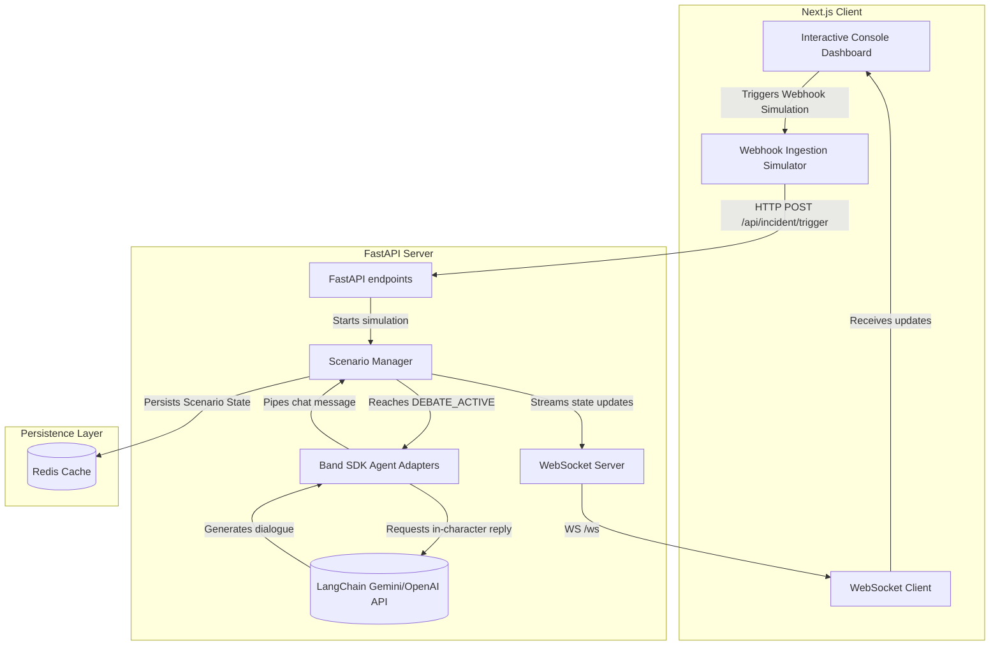

# 🚨 Crisis Command Center — Detailed Technical Documentation

The **Crisis Command Center** is a real-time, interactive multi-agent crisis simulation workspace designed to help enterprise leaders practice and coordinate high-stakes response strategies. Powered by the **Band SDK** (`band-sdk`), the system automates C-suite debates, security logs, financial impact audits, and network mitigations during active threats.

---

## 📖 Table of Contents
1. [System Architecture](#1-system-architecture)
2. [Incident Scenario Library](#2-incident-scenario-library)
3. [Component Directory & Breakdown](#3-component-directory--breakdown)
4. [Critical Data & Message Flows](#4-critical-data--message-flows)
5. [Technical Setup & Run Guides](#5-technical-setup--run-guides)
6. [Testing & Performance Validation](#6-testing--performance-validation)
7. [Security & Authentication Mechanisms](#7-security--authentication-mechanisms)

---

## 1. System Architecture

The project is structured as a decoupled full-stack application consisting of a Next.js frontend client, a FastAPI WebSocket backend, and a Redis persistence cache.



### Next.js Frontend (`/frontend`)
* **Framework:** Next.js 16 + React 19 (compiled with TS).
* **Styling & Theme:** Dark cyber-security dashboard utilizing glassmorphism, responsive Tailwind CSS grid layouts, and clean visual structures.
* **Animations:** Framer Motion-driven transitions, glowing states, and active scanning lines to represent processing agents.
* **3D Visualizations:** Three.js-rendered `SeverityOrb` representing real-time system threat metrics.
* **Data Charts:** Recharts-driven `PredictiveChart` charting project outage duration vs. cumulative financial loss.

### FastAPI Backend (`/backend`)
* **Framework:** Python-based FastAPI + Uvicorn server.
* **Routing:** Dual protocol support for REST endpoints (alert triggers, health checks) and WebSockets (real-time state streaming).
* **Orchestration:** Driven by the custom `ScenarioManager` loop.
* **LangChain Integration:** Connects to Google Gemini (or OpenAI fallback) to generate context-aware, in-character agent dialogue.
* **Agent Adapters:** Utilizes the real `SimpleAdapter` classes from the `band` library to model C-suite behavior.

---

## 2. Incident Scenario Library

The Command Center is pre-configured with 10 industry-standard incident scenarios, each activating specific AI agents and containment labels:

| ID | Title | Primary Threat Vector | Containment Directives | Activated Agents |
| :--- | :--- | :--- | :--- | :--- |
| **INC-001** | Database Breach | SQL Injection / PII Leak | DB Shutdown vs. Segment Isolation | Detection, Security, Infra, Legal, Finance, CX, PR, CEO, CFO, CISO |
| **INC-002** | Regional Cloud Outage | AWS us-east-1 EBS Failure | West Failover vs. Local Recovery | Infra, Recovery, Finance, CX, CTO, CEO |
| **INC-003** | Enterprise Ransomware | LockBit 3.0 Mass Encryption | Rebuild Backups vs. Pay Ransom | Security, Legal, Recovery, Finance, CEO, CISO |
| **INC-004** | GDPR Compliance | Expired Legacy Backup Retained | Voluntary Self-Disclose vs. Silent Wipe | Legal, Risk, Finance, CEO, CFO |
| **INC-005** | Brand Reputation Crisis | Social Media Defamation | Public Apology vs. Ad Counter-Campaign | PR, Risk, CX, CEO, Marketing |
| **INC-006** | Malicious Insider | Admin Bulk File Download | Revoke AD Access vs. Silent Tracking | Security, Legal, HR, CEO, CISO |
| **INC-007** | Global Product Recall | QA Hardware Battery Runaway | Global Product Recall vs. Lot Swap | Operations, Legal, Finance, PR, CEO |
| **INC-008** | Financial Fraud | Transaction daily cap bypass | Freeze Gateway vs. Observe & Map | Finance, Risk, Security, Legal, CEO, CFO |
| **INC-009** | Supply Chain Failure | Port Strike Halting Components | Halt Production vs. Air Freight Premium | Operations, Finance, Risk, CEO, CFO, CTO |
| **INC-010** | Enterprise Perfect Storm | Coordinated state-sponsored attack | Global Lockdown vs. Segmented Battle | All 16 Command Center Agents |

---

## 3. Component Directory & Breakdown

### Frontend Components (`/frontend/src`)
* [page.tsx](file:///d:/lablab/frontend/src/app/page.tsx): Main console shell. Coordinates layouts, triggers, chat lists, decision options, and scroll-spy headers.
* [SpaceBackground.tsx](file:///d:/lablab/frontend/src/components/SpaceBackground.tsx): Renders a WebGL particle starfield shader background for optimal dashboard branding.
* [NeuralGraph.tsx](file:///d:/lablab/frontend/src/components/NeuralGraph.tsx): SVG-drawn diagram displaying current communication links and active data links between C-suite and security nodes.
* [SeverityOrb.tsx](file:///d:/lablab/frontend/src/components/SeverityOrb.tsx): Three.js canvas animating a spherical grid that distorts, speeds up, and changes color as the system's risk score increases.
* [PredictiveChart.tsx](file:///d:/lablab/frontend/src/components/PredictiveChart.tsx): Recharts AreaChart graphing potential losses depending on response delay.
* [CommandCenterContext.tsx](file:///d:/lablab/frontend/src/context/CommandCenterContext.tsx): Main React context managing state (active scenario status, audit logs, alerts, WebSockets reconnect logic).

### Backend Components (`/backend`)
* [main.py](file:///d:/lablab/backend/main.py): Application entry point. Configures CORS, rate limiting, REST endpoints, WebSocket listeners, and handles startup state restoration.
* [scenario.py](file:///d:/lablab/backend/scenario.py): Houses the main `ScenarioManager` loop. Steps through simulation milestones (`DETECTION` → `INVESTIGATION` → `RISK_LEGAL` → `DEBATE_ACTIVE` → `RESOLVED`).
* [persistence.py](file:///d:/lablab/backend/persistence.py): Implements the `RedisPersistence` client. Caches the active state and logs so the system survives backend restarts. Runs in-memory if Redis is offline.
* [agents.py](file:///d:/lablab/backend/agents.py): Data schema definition registry containing the Pydantic models for scenarios, steps, and default agents.
* [band_agents.py](file:///d:/lablab/backend/band_agents.py): Defines the real **Band SDK** adapters (`SimpleAdapter` subclasses) implementing automated character behaviors.
* [run_real_band_agents.py](file:///d:/lablab/backend/run_real_band_agents.py): Standalone script to register and execute agent adapters live on the [app.band.ai](https://app.band.ai) cloud platform.

---

## 4. Critical Data & Message Flows

### WebSocket Live State Updates
```
[Frontend Client]                    [FastAPI Server]                 [Redis Database]
       |                                     |                                |
       | -------- Web Socket Connect ------> |                                |
       |                                     | ---> Read cached state ------->|
       |                                     | <--- Return last state --------|
       | <------- Send current state ------- |                                |
       |                                     |                                |
```

### The Multi-Agent Debate Loop
When the simulation reaches the `DEBATE_ACTIVE` milestone, the backend initiates a mock-room SDK sequence:
1. **System Alert Message:** The `ScenarioManager` broadcasts a `PlatformMessage` prompting the debate.
2. **CISO Analysis:** `CISOBandAdapter.on_message` evaluates the context via LLM and calls `tools.send_message` proposing database/asset quarantine.
3. **CFO Audit:** `CFOBandAdapter.on_message` ingests the CISO's response, audits potential downtime revenue loss, and replies offering network isolation.
4. **CEO Consensus Call:** `CEOBandAdapter.on_message` reads the CFO's rebuttal, summarizes the choices, and prompts the operator for a final command directive.
5. **State Broadcast:** The generated C-suite conversation is packaged and sent over the WebSocket directly to the Next.js chat log.

---

## 5. Technical Setup & Run Guides

### 1. Environment Configurations
Copy `.env.example` to `.env` in the root:
```ini
# Backend API Key & Host parameters
API_KEY=your-custom-auth-key
REDIS_URL=redis://localhost:6379/0
RATE_LIMIT=10/minute

# LLM Providers (Required for Live Agent Dialogue)
GEMINI_API_KEY=your-gemini-api-key
OPENAI_API_KEY=your-openai-api-key

# Band SDK Remote Agent Credentials (Optional)
CISO_AGENT_ID=your-ciso-agent-uuid
CISO_API_KEY=your-ciso-api-key
CFO_AGENT_ID=your-cfo-agent-uuid
CFO_API_KEY=your-cfo-api-key
CEO_AGENT_ID=your-ceo-agent-uuid
CEO_API_KEY=your-ceo-api-key
```

### 2. Start the Backend
Using `uv` for python environment and dependency management:
```bash
cd backend
uv sync
uv run uvicorn main:app --host 0.0.0.0 --port 8000 --reload
```

### 3. Start the Frontend
Install dependencies and boot up the Next.js dev server:
```bash
cd frontend
npm install
npm run dev
```

---

## 6. Testing & Performance Validation

The system contains end-to-end unit, integration, and load testing coverage to guarantee performance and stability:

### Backend Pytest Suite
Verifies Pydantic validation schemas, FastAPI routes, and persistence fallbacks:
```bash
cd backend
uv run pytest
```

### Frontend Vitest Suite
Verifies components, Three.js mocks, and context WebSocket connections:
```bash
cd frontend
npm run test
```

### Locust Load Testing
Simulates stress-testing under multiple concurrent client sessions:
```bash
cd backend
# Launch web interface (available at http://localhost:8089)
locust -f locustfile.py --host http://localhost:8000
```

---

## 7. Security & Authentication Mechanisms

The system is configured with multiple defensive layers suitable for enterprise deployment:
1. **API Key Verification:** The REST endpoint `/api/incident/trigger` (which ingests external Datadog or PagerDuty webhooks) requires an `X-API-Key` header verified against the server's configured environment variable.
2. **WebSocket Handshakes:** The `/ws` real-time channel validates connection requests by checking for the `api_key` parameter in the query string.
3. **Rate Limiting:** Protects the FastAPI server from Denial of Service (DoS) attacks on webhook endpoints by enforcing configured rate limit constraints (e.g. `10/minute`) via FastAPI `slowapi`.
