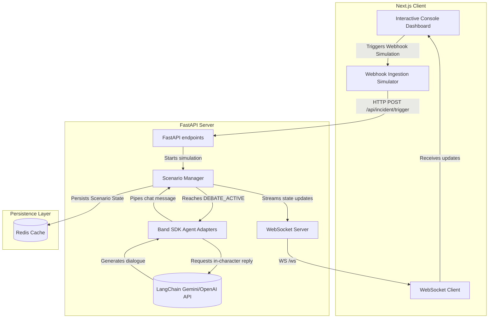

# 🚨 Crisis Command Center (Band SDK Powered)

[](https://github.com/manishgounder71-prog/Lab/actions/workflows/ci.yml)

The **Crisis Command Center** is a real-time, interactive multi-agent crisis simulation and C-suite debate workspace. It simulates high-stakes enterprise security, financial, and operational crises, allowing an operator to coordinate responses through an autonomous network of AI agents.

This project is built for the **Band of Agents Hackathon** hosted by **Lablab.ai**, leveraging the **Band SDK** (`band-sdk`) to orchestrate communication and collaboration between autonomous agents.

---

## 🏗️ Architecture Overview



The application is structured into two main components:

1. **Next.js Frontend (`/frontend`)**
   * A premium, glassmorphic dark-theme dashboard powered by **Next.js 16**, **TypeScript**, and **Framer Motion**.
   * Displays real-time metrics (Risk Score, Revenue at Risk, Affected Users, Regional Node degradation).
   * Renders the interactive C-suite debate logs, live security audit trails, and a dynamic strategic decision matrix.
   * Includes 10 pre-configured incident scenarios that can be simulated locally or integrated via WebSockets.

2. **FastAPI Backend (`/backend`)**
   * Drives the visual simulation steps (`DETECTION` → `INVESTIGATION` → `RISK_LEGAL` → `DEBATE_ACTIVE` → `RESOLVED`).
   * Implements real **Band SDK Agent Adapters** (`band_agents.py`) by subclassing `SimpleAdapter` for key roles: **CISO** (Chief Information Security Officer), **CFO** (Chief Financial Officer), and **CEO** (Chief Executive Officer).
   * Uses **LangChain** with **Google Gemini** (or **OpenAI** as fallback) to generate in-character agent debate messages, with rule-based heuristics fallback for offline testing.
   * Streams live dialogue and scenario status updates over WebSockets directly to the Next.js client.

---

## 🚀 Incident Scenarios

The workspace supports 10 crisis scenarios representing real-world enterprise threats:
* **INC-001: Active Database Breach** (SQL Injection exfiltrating PostgreSQL data)
* **INC-002: Regional Cloud Outage** (AWS us-east-1 connection drops / EBS failure)
* **INC-003: Enterprise Ransomware Incident** (LockBit 3.0 payload spreading across corporate desktops)
* **INC-004: GDPR Compliance Violation** (Legacy server retaining expired PII customer records)
* **INC-005: Brand Reputation Crisis** (Viral social media hashtag claiming device tracking)
* **INC-006: Malicious Insider Activity** (Anomalous bulk DBA credential file downloads)
* **INC-007: Global Product Recall** (Thermal safety defect in production battery lot)
* **INC-008: Large Scale Financial Fraud** (Suspicious API transaction limit bypasses)
* **INC-009: Supply Chain Failure** (Long Beach port strike halting component logistics)
* **INC-010: Enterprise Perfect Storm** (Simultaneous cyberattack, cloud outage, GDPR breach, and PR crisis)

---

## 🛠️ Quick Start (Local Setup)

### Prerequisites
* [Node.js](https://nodejs.org/) (v18+)
* [Python 3.10+](https://www.python.org/)
* [uv](https://github.com/astral-sh/uv) (Recommended lightning-fast Python package installer)

### 1. Configure Environment Variables
Copy `.env.example` to `.env` in both the root/backend directories:
```bash
cp .env.example backend/.env
```
Populate your API keys:
* **`GEMINI_API_KEY`**: Your Gemini API key for live LLM agent dialogue.
* **Agent IDs and Keys**: Grab these from the [app.band.ai](https://app.band.ai) dashboard when registering your remote agents.

### 2. Run the Backend
Navigate to the `/backend` folder, sync dependencies, and start the FastAPI WebSocket server on port `8000`:
```bash
cd backend
uv sync
uv run uvicorn main:app --host 0.0.0.0 --port 8000 --reload
```

### 3. Run the Frontend
Navigate to the `/frontend` folder, install node modules, and start the Next.js dev server on port `3000`:
```bash
cd frontend
npm install
npm run dev
```
Open [http://localhost:3000](http://localhost:3000) to access the interactive dashboard.

---

## 🌐 Hackathon Cloud Deployment (Band SDK Platform)

To run the same C-suite agent adapters live in a room on the real [band.ai](https://app.band.ai) platform:

1. Register **CISO**, **CFO**, and **CEO** agents on the [app.band.ai](https://app.band.ai) portal.
2. Add the generated **Agent IDs** and **API Keys** to `backend/.env`.
3. Launch the cloud agent runner script in the backend directory:
   ```bash
   uv run python run_real_band_agents.py
   ```
This registers the adapters live on the platform. Any messages sent in the active Band room will trigger the adapters to coordinate, debate, and return responses.

---

## 🧪 Testing

Both backend and frontend codebases include robust test suites:

* **Backend Unit Tests (147 passed)**:
  ```bash
  cd backend
  uv run pytest
  ```
* **Frontend React Tests (52 passed)**:
  ```bash
  cd frontend
  npm run test
  ```
